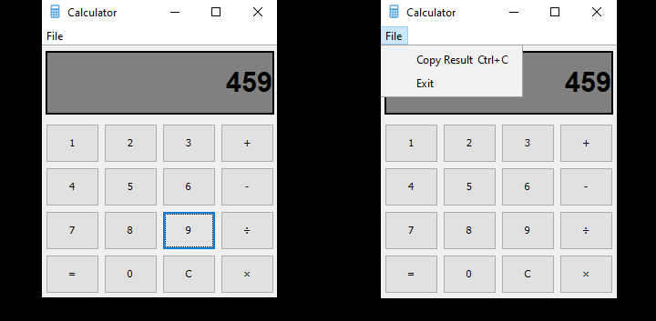

# Simple GUI calculator
In this mini project, I implemented a simple graphical calculator.
Although it's not a hard project, it's a good example for learning GUI programming and eventHandling concepts.
This project also good for learning how to work with both clicking buttons and pressing keyboard, file menu, and so on. 

## Output
You can see the output below:

